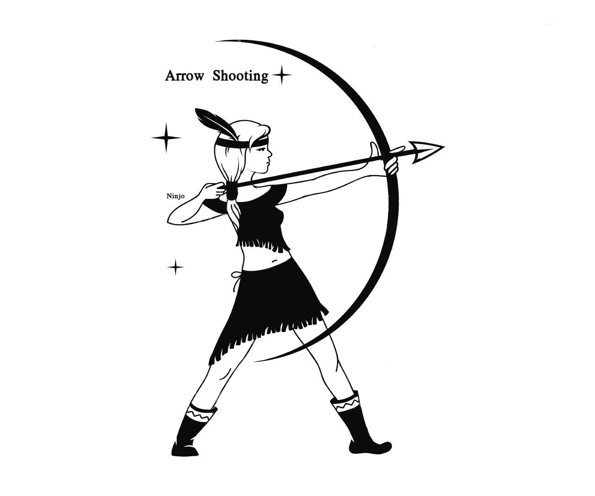

# Arrow-Shooting

Arrow Shooting Game using C++ and OpenGL



inital design of the game idea:


design fire function:


# Usage:

## Build:

```
$ g++ main.cpp -o arrowGame -lGL -lGLU -lglut
$ ./arrowGame
```

## Keys:<br>

`[Up]` -> increase arrow angle<br>
`[Down]` -> decrease arrow angle<br>
`[Left]` -> reset arrow position to default<br>
`[Right]` -> shoot arrow<br>
`[Space]` -> shoot arrow<br>
`[R]` -> restart game<br>
