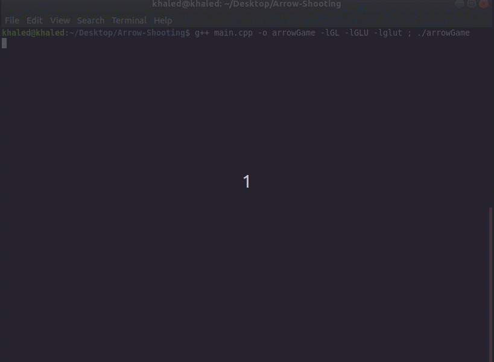
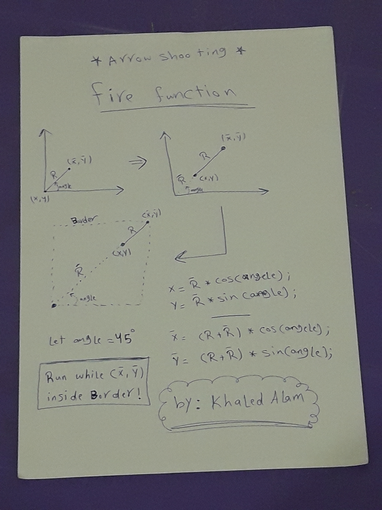
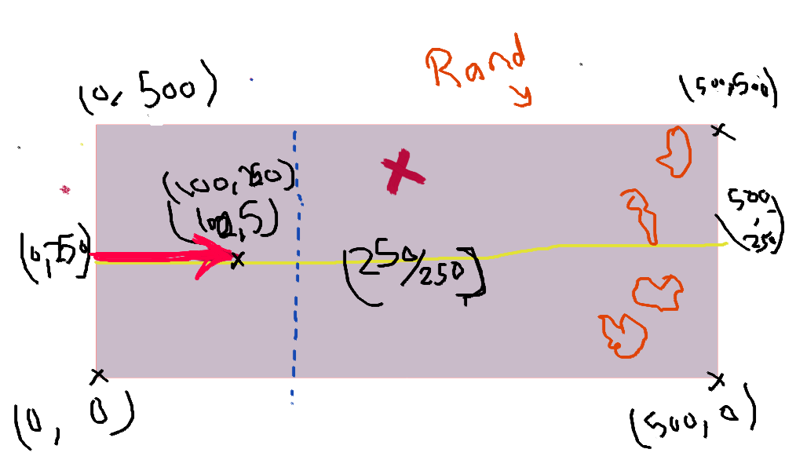

# Arrow-Shooting

Arrow Shooting Game using C++ and OpenGL


# Preview:







# Usage:

## Build:

```
$ g++ main.cpp -o arrowGame -lGL -lGLU -lglut
$ ./arrowGame
```

## Keys:<br>

[Up] -> increase arrow angle<br>
[Down] -> decrease arrow angle<br>
[Left] -> reset arrow position to default<br>
[Right] -> shoot arrow<br>
[Space] -> shoot arrow<br>
[R] -> restart game<br>
